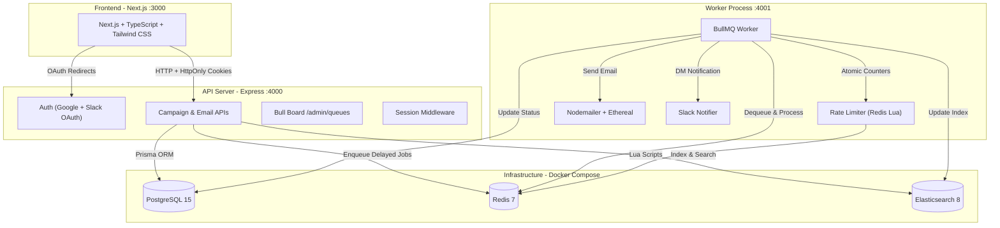

# ReachInbox.ai — Email Campaign Scheduler

A production-quality monorepo for scheduling, sending, and tracking email campaigns with intelligent rate limiting, real-time monitoring, and fault-tolerant job processing.

> **No cron jobs are used anywhere in this project.** All scheduling is handled by BullMQ delayed jobs.

## Architecture



## Tech Stack

| Layer | Technology |
|-------|-----------|
| Frontend | Next.js 14 + TypeScript + Tailwind CSS v3 |
| Backend | Express.js + TypeScript |
| Database | PostgreSQL 15 + Prisma ORM |
| Queue | BullMQ + Redis 7 |
| SMTP | Nodemailer + Ethereal Email |
| Search | Elasticsearch 8 |
| Queue Dashboard | Bull Board |
| Auth | Google OAuth 2.0 (real) |
| Slack | Slack OAuth + Web API (real) |
| Infrastructure | Docker Compose |

## Quick Start

### Prerequisites

- Node.js 18+
- Docker & Docker Compose
- Google Cloud Console project (for OAuth)

### 1. Clone & Install

```bash
cd OutBoxLabs
cp .env.example .env
# Edit .env with your credentials (see sections below)
npm install
```

### 2. Start Infrastructure

```bash
docker compose up -d
```

This starts PostgreSQL, Redis, and Elasticsearch with persistent volumes.

### 3. Initialize Database

```bash
npm run db:push
```

### 4. Start Development

```bash
npm run dev
```

This concurrently starts:
- **API** on http://localhost:4000
- **Worker** on http://localhost:4001 (health check)
- **Frontend** on http://localhost:3000

### 5. Access

- **App**: http://localhost:3000
- **Bull Board**: http://localhost:4000/admin/queues (requires login)
- **Health Check**: http://localhost:4000/health

---

## 🚀 Production Deployment

See [DEPLOYMENT.md](DEPLOYMENT.md) for full instructions on deploying to **Railway**, **Render**, **Vercel**, or **Single VPS / Docker Compose** (`docker-compose.prod.yml`).

```bash
# 1-Command Production Deployment on VPS:
docker compose -f docker-compose.prod.yml up -d --build
```

## Setup Guides

### Google OAuth Setup

1. Go to [Google Cloud Console](https://console.cloud.google.com/apis/credentials)
2. Create a new OAuth 2.0 Client ID (Web Application)
3. Add authorized redirect URI: `http://localhost:4000/auth/google/callback`
4. Copy Client ID and Client Secret to `.env`:
   ```
   GOOGLE_CLIENT_ID=your-client-id
   GOOGLE_CLIENT_SECRET=your-client-secret
   ```

### Slack OAuth Setup

1. Go to [Slack API](https://api.slack.com/apps) and create a new app
2. Under **OAuth & Permissions**, add redirect URL: `http://localhost:4000/auth/slack/callback`
3. Add Bot Token Scopes: `chat:write`, `channels:read`
4. Add User Token Scopes: `identity.basic`, `identity.email`
5. Copy Client ID and Client Secret to `.env`:
   ```
   SLACK_CLIENT_ID=your-slack-client-id
   SLACK_CLIENT_SECRET=your-slack-client-secret
   ```

### Ethereal SMTP Setup

1. Go to [Ethereal Email](https://ethereal.email/create)
2. Create a free account
3. Copy credentials to `.env`:
   ```
   ETHEREAL_USER=your-user@ethereal.email
   ETHEREAL_PASS=your-password
   ```
4. View sent emails at: https://ethereal.email/messages

---

## Core Features

### Email Scheduling (No Cron Jobs)

Scheduling uses **BullMQ delayed jobs** exclusively:

1. User creates a campaign with `startTime`, `delayBetweenMs`, and `hourlyLimit`
2. Each email's `scheduledAt` = `startTime + index × delayBetweenMs`
3. BullMQ delay = `scheduledAt - now` (milliseconds)
4. Jobs are stored in Redis with auto-processing at the correct time

### Restart Persistence

**Redis/BullMQ delayed jobs survive API/worker restarts.** This is guaranteed because:

- Redis is configured with AOF persistence (`appendonly yes`)
- BullMQ stores job state in Redis, not in process memory
- The API does NOT clear Redis or recreate all jobs on startup

**Startup Reconciliation:**
On API startup, a one-time reconciliation check finds any EmailJobs in the DB with `status=SCHEDULED` that may not have been enqueued (due to a crash between DB write and BullMQ enqueue). It re-adds them with deterministic `jobId`, which makes the operation idempotent — BullMQ silently ignores duplicate jobIds.

### Idempotency

Multiple layers prevent duplicate sends:

| Layer | Mechanism |
|-------|-----------|
| BullMQ | Deterministic `jobId` = `email-job-{dbId}` — prevents duplicate queue entries |
| Database | `@@unique([campaignId, recipient])` — prevents duplicate recipients per campaign |
| Worker | Checks DB status before processing — skips if already `SENT` |
| Worker | Atomic status transition `SCHEDULED → PROCESSING` — prevents concurrent processing |

**Documented trade-off:** There is a small crash window between SMTP acceptance and DB status update. If the worker crashes in this exact moment, a retry could cause a duplicate send. SMTP does not provide exactly-once delivery guarantees. This is an inherent limitation, not a bug.

### Concurrency & Rate Limiting

#### Worker Concurrency

Configured via `WORKER_CONCURRENCY` (default: 5). BullMQ processes up to N jobs simultaneously.

#### Minimum Send Interval (`MIN_SEND_INTERVAL_MS`)

Enforced per-sender using a Redis Lua script that atomically tracks the last send time. Prevents burst sending even within rate limits.

#### Per-Sender Hourly Limit (`MAX_EMAILS_PER_HOUR_PER_SENDER`)

**Redis-backed atomic counters using Lua:**

```lua
-- Atomic check-and-increment in a single Redis operation
local key = KEYS[1]     -- ratelimit:{sender}:{hourWindow}
local max = ARGV[1]     -- e.g., 50
local current = GET(key) or 0
if current >= max then return BLOCKED
INCR(key)
EXPIRE(key, 3600)       -- Auto-expire after 1 hour
return ALLOWED
```

**This is safe across multiple worker instances** because:
- Lua scripts execute atomically in Redis (no race conditions)
- No in-memory counters are used
- The hourly window key auto-expires

#### When Rate Limit is Exceeded

When a sender's hourly limit is reached, the email is **NOT failed or dropped**:

1. The worker calculates the next available hour window
2. The BullMQ job is rescheduled with a new delay (+ random jitter to prevent thundering herd)
3. The DB `scheduledAt` is updated to the new time
4. A Slack notification is sent to the connected user (deduplicated per sender/hour)
5. Ordering is preserved as much as possible

### Handling 1000+ Jobs

The system handles 1000+ emails scheduled around the same time by:

1. **BullMQ delayed jobs**: Each email gets a precise `delay` based on its index × configured delay
2. **Worker concurrency**: Processes N jobs simultaneously
3. **Rate limiting**: Automatically throttles and reschedules excess emails
4. **Redis atomicity**: No race conditions even under high concurrency
5. **DB batch inserts**: `createMany` with `skipDuplicates` for efficient persistence

### Elasticsearch

Emails are indexed in Elasticsearch for full-text search across:
- Recipient
- Subject  
- Body
- Status
- Sender

**Tenant isolation**: All queries are filtered by `userId` — users can only search their own emails.

**Fault tolerance**: ES failures never mark successful SMTP sends as failed. ES indexing is best-effort and non-blocking.

### Bull Board

Live queue dashboard at `/admin/queues` showing:
- Delayed jobs (scheduled for future)
- Waiting jobs (ready to process)
- Active jobs (currently processing)
- Completed jobs
- Failed jobs

**Protected by session-based authentication** — only logged-in users can access it.

---

## API Reference

| Method | Endpoint | Auth | Description |
|--------|----------|------|-------------|
| GET | `/auth/google` | No | Initiate Google OAuth |
| GET | `/auth/google/callback` | No | Google OAuth callback |
| POST | `/auth/logout` | No | Destroy session |
| GET | `/auth/slack` | Yes | Initiate Slack OAuth |
| GET | `/auth/slack/callback` | No | Slack OAuth callback |
| POST | `/auth/slack/disconnect` | Yes | Disconnect Slack |
| GET | `/api/me` | Yes | Get user profile |
| POST | `/api/campaigns` | Yes | Create campaign |
| GET | `/api/campaigns` | Yes | List campaigns |
| GET | `/api/emails/scheduled` | Yes | Scheduled emails (paginated) |
| GET | `/api/emails/sent` | Yes | Sent emails (paginated) |
| GET | `/api/emails/search?q=` | Yes | Search emails (Elasticsearch) |
| GET | `/admin/queues` | Yes | Bull Board dashboard |
| GET | `/health` | No | Health check |

---

## Testing

```bash
# Run all tests
npm run test

# Run with coverage
npx vitest run --coverage
```

Tests cover:
- Email parsing & deduplication
- Scheduling time calculations
- Zod validation schemas
- Rate limit key generation
- Deterministic job ID generation

---

## Project Structure

```
OutBoxLabs/
├── apps/
│   ├── api/                    # Express.js API server
│   │   ├── prisma/schema.prisma
│   │   └── src/
│   │       ├── config/         # Environment config
│   │       ├── controllers/    # Request handlers
│   │       ├── middleware/     # Auth, validation, errors
│   │       ├── queues/         # BullMQ queue instances
│   │       ├── repositories/   # Database access layer
│   │       ├── routes/         # Express route definitions
│   │       ├── services/       # Business logic
│   │       └── utils/          # Prisma, Redis, ES, Logger
│   ├── worker/                 # BullMQ worker process
│   │   └── src/
│   │       ├── config/
│   │       ├── processor.ts    # Job processing logic
│   │       ├── rateLimiter.ts  # Redis Lua rate limiting
│   │       ├── emailSender.ts  # Nodemailer/Ethereal
│   │       ├── slackNotifier.ts
│   │       └── utils/
│   └── web/                    # Next.js frontend
│       └── src/
│           ├── app/            # Pages (login, dashboard)
│           ├── components/     # Reusable UI components
│           └── lib/            # API client, utilities
├── packages/
│   └── shared/                 # Shared types, utils, validation
├── docker-compose.yml
├── .env.example
└── README.md
```

---

## Assumptions & Trade-offs

1. **Ethereal SMTP for dev**: Emails are caught by Ethereal (not delivered to real inboxes). Swap the SMTP config for production use.

2. **Session-based auth**: Uses PostgreSQL-backed sessions with HttpOnly cookies. Simpler than JWT for this use case and more secure (no token in localStorage).

3. **Elasticsearch is optional**: The app functions without ES — search gracefully returns empty results. ES failures never affect email delivery.

4. **Slack is optional**: Processing continues normally without Slack connected. Users can connect/disconnect without redeployment.

5. **No cron jobs**: All scheduling uses BullMQ delayed jobs. Reconciliation runs once at API startup (not periodically).

6. **UTC internally**: All timestamps stored in UTC. Frontend displays in the user's local timezone using browser APIs.

---

## Demo Instructions

1. Start all services (`docker compose up -d && npm run dev`)
2. Navigate to http://localhost:3000
3. Sign in with Google
4. Click "Compose" to create a campaign
5. Use these sample recipients: `test1@example.com, test2@example.com, test3@example.com`
6. Set start time to 1 minute from now, delay 5 seconds, hourly limit 10
7. Watch the "Scheduled" tab update as emails are processed
8. Check Bull Board at http://localhost:4000/admin/queues
9. View sent emails at https://ethereal.email/messages
10. Connect Slack and test rate limit notifications

---

## Environment Variables

See [.env.example](.env.example) for the complete list with descriptions.
